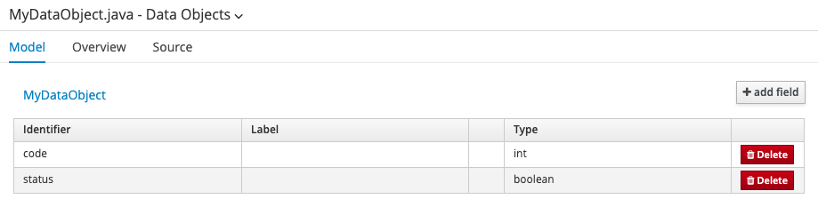
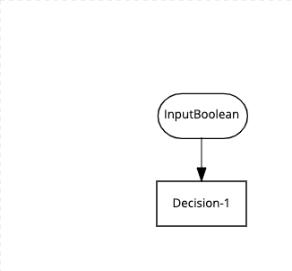
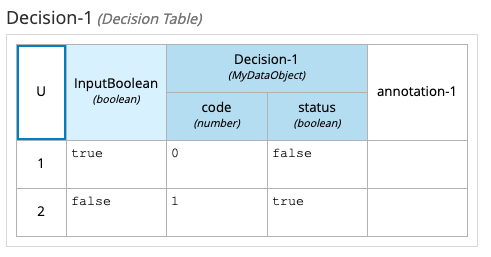
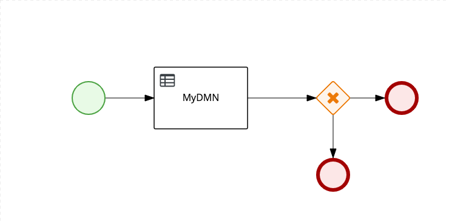
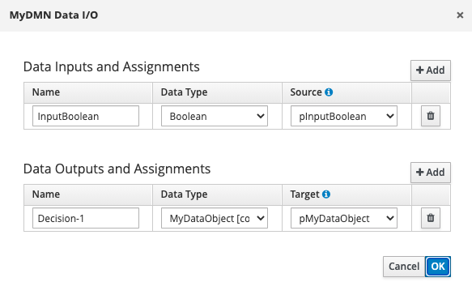
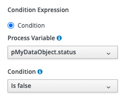

# kie-examples-1

This example was created to illustrate a bug/feature request to be able to map the output of a DMN back to a data object using the Data Output Assignments.

We created a [Data Object](./src/main/java/com/myspace/exampleproject/MyDataObject.java) as follows:



Then we created a DMN named [MyDMN](./src/main/resources/MyDMN.dmn):



with a single decision table node:



Then we added a call to this DMN from a BPMN process, [Process1](./src/main/resources/Process1.bpmn):



And in this call, we have mapped the output assignments:



This gives us the benefits of being able to use the data object in conditional expressions:



However, when executed at runtime, as illustrated by `myTest1` in [MyExampleTest](./src/test/java/com/myspace/exampleproject/MyExampleTest.java), we get the following exception:

```
org.jbpm.workflow.instance.WorkflowRuntimeException: [ExampleProject.Process1:1 - MyDMN:1] -- [ExampleProject.Process1:1 - ?:5] -- Exception when trying to evaluate constraint  in split null
	at org.jbpm.workflow.instance.node.RuleSetNodeInstance.handleException(RuleSetNodeInstance.java:206)
...
	at java.base/java.lang.Thread.run(Thread.java:834)
Caused by: org.jbpm.workflow.instance.WorkflowRuntimeException: [ExampleProject.Process1:1 - ?:5] -- Exception when trying to evaluate constraint  in split null
	at org.jbpm.workflow.instance.node.SplitInstance.internalTrigger(SplitInstance.java:66)
...
	at org.jbpm.workflow.instance.node.RuleSetNodeInstance.internalTrigger(RuleSetNodeInstance.java:145)
	... 128 common frames omitted
Caused by: java.lang.RuntimeException: Exception when trying to evaluate constraint  in split null
	at org.jbpm.workflow.instance.node.SplitInstance.executeStrategy(SplitInstance.java:95)
	at org.jbpm.workflow.instance.node.SplitInstance.internalTrigger(SplitInstance.java:62)
	... 136 common frames omitted
Caused by: java.lang.RuntimeException: unable to execute ReturnValueEvaluator: 
	at org.jbpm.process.instance.impl.ReturnValueConstraintEvaluator.evaluate(ReturnValueConstraintEvaluator.java:130)
	at org.jbpm.workflow.instance.node.SplitInstance.executeStrategy(SplitInstance.java:85)
	... 137 common frames omitted
Caused by: java.lang.ClassCastException: class java.util.HashMap cannot be cast to class com.myspace.exampleproject.MyDataObject (java.util.HashMap is in module java.base of loader 'bootstrap'; com.myspace.exampleproject.MyDataObject is in unnamed module of loader 'app')
	at com.myspace.exampleproject.Process_com$u46$myspace$u46$exampleproject$u46$Process1482820193ReturnValueEvaluator1Invoker.evaluate(Process_com$u46$myspace$u46$exampleproject$u46$Process1482820193ReturnValueEvaluator1Invoker.java:12)
	at org.jbpm.process.instance.impl.ReturnValueConstraintEvaluator.evaluate(ReturnValueConstraintEvaluator.java:128)
	... 138 common frames omitted
```

## Running the example

Clone the repo, and run:

```java
./gradlew test
```

## Workaround

We included [Process2](./src/main/resources/Process2.bpmn) to illustrate a workaround.
The workaround is to map the output from the DMN to an Object, and then use a FEEL expression in the conditional expression.
This is illustrated by `myTest2` in [MyExampleTest](./src/test/java/com/myspace/exampleproject/MyExampleTest.java) where
the output object is an instance of HashMap.

## Fix

We contributed a fix to jBPM as part of this PR: https://github.com/kiegroup/jbpm/pull/1840 
